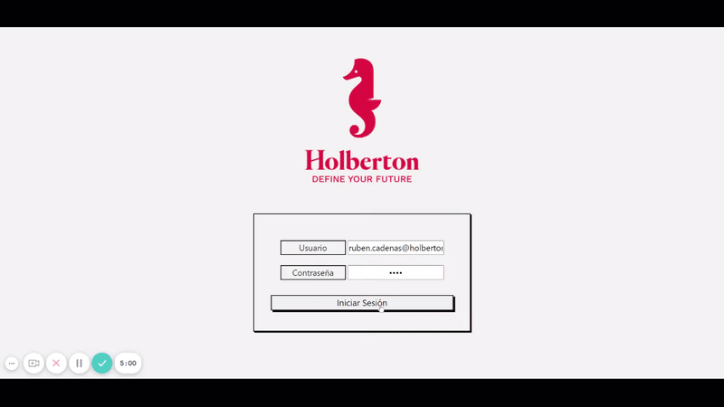

<div id="top"></div>
<!--
*** Thanks for checking out the Best-README-Template. If you have a suggestion
*** that would make this better, please fork the repo and create a pull request
*** or simply open an issue with the tag "enhancement".
*** Don't forget to give the project a star!
*** Thanks again! Now go create something AMAZING! :D
-->


<!-- PROJECT SHIELDS -->
<!--
*** I'm using markdown "reference style" links for readability.
*** Reference links are enclosed in brackets [ ] instead of parentheses ( ).
*** See the bottom of this document for the declaration of the reference variables
*** for contributors-url, forks-url, etc. This is an optional, concise syntax you may use.
*** https://www.markdownguide.org/basic-syntax/#reference-style-links
-->

<!-- PROJECT LOGO -->
<br />
<div align="center">
  <a href="https://github.com/othneildrew/Best-README-Template">
    
  </a>

  <h3 align="center">Job Bank Holberton</h3>

  <p align="center">
    The website allow Hiring Partners of Holberton School Peru to review the CVs of the students and post their recruiting positions available.
    <br />
    <a href="https://github.com/alexriveracruz4/job_bank_holberton"><strong>Explore the docs »</strong></a>
    <br />
    <br />
  </p>
</div>


<!-- TABLE OF CONTENTS -->
  <summary>Table of Contents</summary>
  <ol>
    <li>
      <a href="#about-the-project">About The Project</a>
      <ul>
        <li><a href="#built-with">Built With</a></li>
      </ul>
    </li>
    <li>
      <a href="#getting-started">Getting Started</a>
      <ul>
        <li><a href="#prerequisites">Prerequisites</a></li>
        <li><a href="#installation">Installation</a></li>
      </ul>
    </li>
    <li><a href="#usage">Usage</a></li>
    <li><a href="#contributing">Contributing</a></li>
    <li><a href="#related-projects">Related projects</a></li>
    <li><a href="#license">License</a></li>
  </ol>


<!-- ABOUT THE PROJECT -->
## About The Project
#


#

This project was born from the need that our alma mater Holberton School Peru needs a more organized and easy way to connect Holbies with Hiring Partners, this project will help students a lot to position themselves in the job market as well as Hiring Partners to find true talents.

### Team:
  <ol>
    <li>
      Kenny Reyes
      <ul>
        <li><a href="https://www.linkedin.com/search/results/all/?keywords=kenny%20reyes&origin=RICH_QUERY_SUGGESTION&position=0&searchId=f05d0f94-004f-4b71-b436-a4ac1673bf7a&sid=SKo">LinkedIn</a></li>
        <li><a href="https://github.com/KennyReyesS">GitHub</a></li>
      </ul>
    </li>
    <li>
      Jhonatan Jauja
      <ul>
        <li><a href="https://www.linkedin.com/in/jhonatanjc/">LinkedIn</a></li>
        <li><a href="https://github.com/jhonnjc15">GitHub</a></li>
      </ul>
    </li>
    <li>
      Alex Rivera
      <ul>
        <li><a href="https://www.linkedin.com/search/results/all/?keywords=alex%20rivera%20cruz&origin=RICH_QUERY_SUGGESTION&position=0&searchId=12ea82de-bd0d-485f-bf3a-133f77100897&sid=SIC">LinkedIn</a></li>
        <li><a href="https://github.com/alexriveracruz4">GitHub</a></li>
      </ul>
    </li>
  </ol>

### Built With

* [React.js](https://reactjs.org/)
* [Python](https://www.python.org/)
* [SQLAlchemy](https://www.sqlalchemy.org/)
* [Flask](https://flask.palletsprojects.com/en/2.0.x/)
* [MySQL](https://www.mysql.com/)
* [Bootstrap](https://getbootstrap.com)


<p align="right">(<a href="#top">back to top</a>)</p>


<!-- GETTING STARTED -->
## Getting Started

### Prerequisites


* MySQL
  ```sh
  sudo apt install mysql-server
  ```
* Flask
  ```sh
  pip3 install Flask
  ```
* SQLAlchemy
  ```sh
  sudo pip3 install SQLAlchemy
  ```
  You will need to have Node> = 14.0.0 and npm> = 5.6 
* Node
  ```sh
  cd ~
  curl -sL https://deb.nodesource.com/setup_14.x -o nodesource_setup.sh
  sudo bash nodesource_setup.sh
  sudo apt install nodejs
  ```
  NodeSource's nodejs package contains the node and npm binary, so you don't need to install npm separately. 

### Installation

1. Clone the repo
   ```sh
   https://github.com/alexriveracruz4/job_bank_holberton.git
   ```
2. Install NPM packages
   ```sh
   sudo npm install --save
   ```

<p align="right">(<a href="#top">back to top</a>)</p>


<!-- USAGE EXAMPLES -->
## Usage

1. Excecute the API in the port 5000 with all environment variables.
   ```sh
   JBH_MYSQL_USER=jbh_dev JBH_MYSQL_PWD=jbh_dev_pwd JBH_MYSQL_HOST=localhost JBH_MYSQL_DB=jbh_dev_db JBH_API_HOST=0.0.0.0 JBH_API_PORT=5000 python3 -m api.v1.app
   ```
2. To create any student or partner user, first you should to create at least an admin user.
   ```sh
   curl -X POST http://0.0.0.0:5000/api/v1/admins/ -H "Content-Type: application/json" -d '{"firstname": "Ruben", "lastname": "Cadenas", "email": "ruben.cadenas@holbertonschool.com", "password": "test"}' -vvv
   ```
3. Start the application.
   ```sh
   npm start
   ```
4. Create a new user, for example a new student.



<p align="right">(<a href="#top">back to top</a>)</p>


<!-- CONTRIBUTING -->
## Contributing
Would you like to contribute to this project? You can do it, all the details on how to report bugs and pull requests from users are what keep this project working.

1. Fork the Project
2. Create your Feature Branch (`git checkout -b my-new-feature`)
3. Commit your Changes (`git commit -m 'Add some feature'`)
4. Push to the Branch (`git push origin my-new-feature`)
5. Create a new Pull Request

<p align="right">(<a href="#top">back to top</a>)</p>


<!-- PROJECTS -->
## Related projects


<!-- LICENSE -->
## License

Distributed under the MIT License.

<p align="right">(<a href="#top">back to top</a>)</p>


<!-- MARKDOWN LINKS & IMAGES -->
<!-- https://www.markdownguide.org/basic-syntax/#reference-style-links -->
[contributors-shield]: https://img.shields.io/github/contributors/othneildrew/Best-README-Template.svg?style=for-the-badge
[contributors-url]: https://github.com/othneildrew/Best-README-Template/graphs/contributors
[forks-shield]: https://img.shields.io/github/forks/othneildrew/Best-README-Template.svg?style=for-the-badge
[forks-url]: https://github.com/othneildrew/Best-README-Template/network/members
[stars-shield]: https://img.shields.io/github/stars/othneildrew/Best-README-Template.svg?style=for-the-badge
[stars-url]: https://github.com/othneildrew/Best-README-Template/stargazers
[issues-shield]: https://img.shields.io/github/issues/othneildrew/Best-README-Template.svg?style=for-the-badge
[issues-url]: https://github.com/othneildrew/Best-README-Template/issues
[license-shield]: https://img.shields.io/github/license/othneildrew/Best-README-Template.svg?style=for-the-badge
[license-url]: https://github.com/othneildrew/Best-README-Template/blob/master/LICENSE.txt
[linkedin-shield]: https://img.shields.io/badge/-LinkedIn-black.svg?style=for-the-badge&logo=linkedin&colorB=555
[linkedin-url]: https://linkedin.com/in/othneildrew
[product-screenshot]: images/screenshot.png